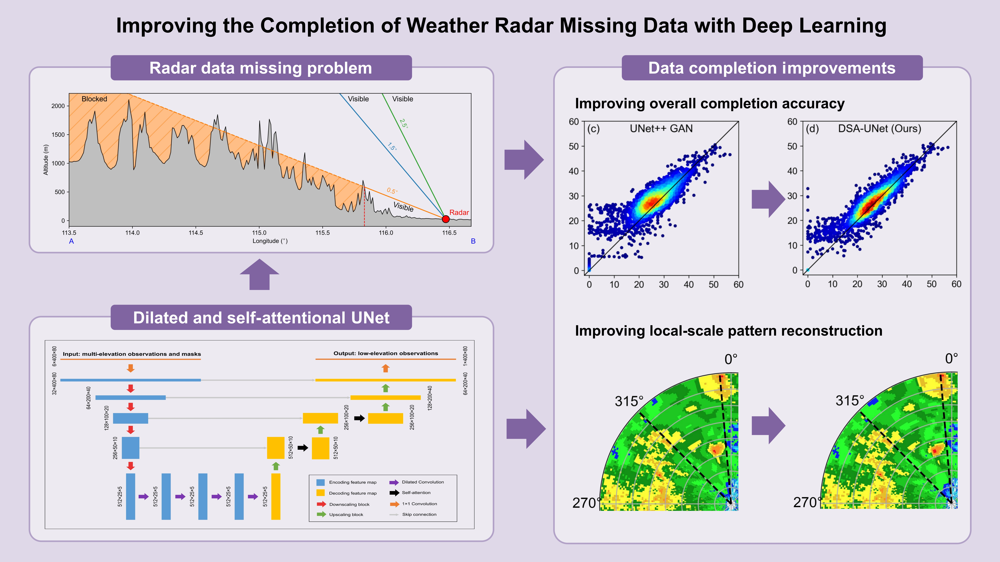

# Improving the Completion of Weather Radar Missing Data with Deep Learning

This repo provides a PyTorch implementation for improving the completion of weather radar missing data with the **dilated and self-attention UNet (DSA-UNet)**.

## Graphical abstract

Weather radars commonly suffer from the data-missing problem that limits their data quality and applications. This study and proposed a DSA-UNet model to improve the completion of radar missing data. The model was found to achieve improvements in the overall completion accuracy and local-scale pattern reconstruction.



## Dependencies

The codes in this study are based on Python 3.8. The following dependencies are also necessary.

```
numpy=1.24.3
scipy=1.10.1
pytorch=1.12.1
matplotlib=3.7.2
pandas=2.0.3
```

## Citation

If you find this repo helpful, please cite the following article.

> Gong, A.; Chen, H.; Ni, G. Improving the Completion of Weather Radar Missing Data with Deep Learning. Remote Sens. 2023, 15, 4568. [https://doi.org/10.3390/rs15184568](https://doi.org/10.3390/rs15184568)
>
